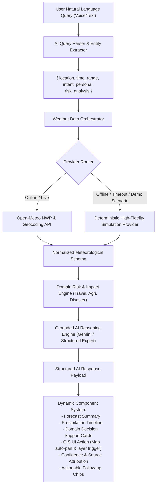

# WeatherGPT — System Architecture & Implementation Plan
*Smart India Hackathon 2026 (SIH26068: WeatherGPT: Conversational AI for Weather Forecasting, Alerts, and Climate Information)*

---

## 1. Executive Summary & Stack Selection

WeatherGPT is an **AI-powered conversational meteorological intelligence and decision-support platform**. Unlike standard weather chatbots that merely query an API and dump raw JSON into a prompt, WeatherGPT executes a strict **Grounding & Orchestration Pipeline**:
1. **Query Parsing & Intent Disambiguation** (extracts location, temporal window, user persona, risk domain).
2. **Deterministic Data Orchestration** (queries Live NWP/Meteorological APIs with deterministic realistic fallback).
3. **Meteorological Risk Engine** (computes domain-specific thresholds for Travel, Agriculture, Aviation, Disaster Management, Schools).
4. **Grounded AI Synthesis** (produces natural language answers with source attribution, uncertainty metrics, and structured UI actions).
5. **Interactive Dynamic UI System** (renders rich forecast cards, rainfall timelines, GIS layers, and voice output).

### Technology Stack Justification
| Layer | Technology | Rationale |
|---|---|---|
| **Framework** | **Next.js (App Router, React, TypeScript)** | High performance, unified fullstack API routes, server-side data fetching, streaming AI responses, zero-friction local and cloud deployment. |
| **Styling & UI** | **Tailwind CSS + Lucide Icons + Custom Glassmorphism** | Apple Weather + Perplexity inspired obsidian glassmorphism (`backdrop-blur-xl`, slate-900/cyan-500 palette, soft neon accents, responsive mobile navigation). |
| **Mapping / GIS** | **Leaflet + React-Leaflet + OpenStreetMap & CartoDB Dark Matter** | Zero-API-key requirement, high frame-rate client-side rendering, geojson polygon support for flood risk/cyclone tracks/alert zones, animated timeline playback. |
| **Charts** | **Recharts** | Smooth responsive SVG charts for climate trends, 2019 vs 2025 anomaly comparisons, and hourly precipitation curves. |
| **Weather Providers** | **Open-Meteo High-Resolution NWP + Fallback Simulation Engine** | Free, open-access, zero-key rate-limit-friendly real-time global and Indian model data (GFS 0.25°, ECMWF, hourly rain, wind, alerts) combined with a deterministic simulation engine for 5 flagship SIH scenarios. |
| **Voice & Speech** | **Web Speech API (SpeechRecognition + SpeechSynthesis)** | Native browser speech recognition and localized voice playback in English and Indian languages (Hindi, Kannada, Tamil, etc.) with graceful fallback. |
| **State & Storage** | **Client-side Storage (IndexedDB/LocalStorage) + Next.js API State** | Instant guest experience with full conversation history, saved locations, notifications, and preference persistence without forced login walls. |

---

## 2. Core Architecture Pipeline



---

## 3. Normalized Meteorological Schema

```typescript
export interface WeatherObservation {
  location: {
    name: string;
    state?: string;
    country: string;
    latitude: number;
    longitude: number;
    elevation?: number;
  };
  timestamp: string;
  temperature: number; // Celsius
  feelsLike: number;
  humidity: number; // %
  pressure: number; // hPa
  windSpeed: number; // km/h
  windDirection: number; // degrees
  windGust?: number;
  precipitation: number; // mm
  precipitationProbability: number; // %
  weatherCode: number;
  weatherDescription: string;
  visibility: number; // km
  uvIndex: number;
  airQualityIndex?: number;
  source: string;
  isSimulated: boolean;
}

export interface HourlyForecast {
  time: string; // ISO
  temperature: number;
  precipitationProbability: number;
  precipitationAmount: number;
  weatherCode: number;
  weatherDescription: string;
  windSpeed: number;
  windDirection: number;
  visibility: number;
  riskLevel: 'LOW' | 'MODERATE' | 'HIGH' | 'CRITICAL';
}

export interface WeatherAlert {
  id: string;
  severity: 'GREEN' | 'YELLOW' | 'ORANGE' | 'RED';
  title: string;
  hazardType: 'RAIN' | 'FLOOD' | 'CYCLONE' | 'HEATWAVE' | 'THUNDERSTORM';
  description: string;
  affectedDistricts: string[];
  validFrom: string;
  validUntil: string;
  issuedAt: string;
  source: string; // e.g. IMD / SDMA
  recommendedPrecautions: string[];
  coordinates?: [number, number];
}

export interface DecisionSupportResult {
  domain: 'TRAVEL' | 'AGRICULTURE' | 'DISASTER' | 'SCHOOLS' | 'AVIATION' | 'MARINE';
  riskLevel: 'LOW' | 'ELEVATED' | 'HIGH' | 'SEVERE';
  headline: string;
  actionableRecommendation: string;
  evidence: string[];
  safeWindows?: string[];
  cautionWindows?: string[];
}
```

---

## 4. Flagship SIH Scenarios

1. **Scenario 1: Bengaluru Rain & Travel Advisory**
   - Query: *"Will it rain tomorrow in Bengaluru, and is it safe to travel?"*
   - Output: Afternoon peak rainfall (3-6 PM, 14mm/h), elevated travel risk on arterial roads (Outer Ring Road, NH-44), recommended departure window before 2:00 PM, 88% model confidence, ECMWF/GFS provenance.
2. **Scenario 2: Farmer Pesticide Spraying Advisory**
   - Query: *"Should I spray pesticides tomorrow in Mysuru?"*
   - Output: Agriculture Decision card warning of rain wash-off risk; suggests rescheduling to Friday morning when wind is <12 km/h and rain probability is <15%.
3. **Scenario 3: Cyclone Warning & Disaster Management**
   - Query: *"What is the cyclone alert status in Chennai?"*
   - Output: Severe Orange/Red Alert; trajectory cone visualization on GIS Map; coastal wind speeds 65-80 km/h; port warnings & shelter readiness instructions.
4. **Scenario 4: Urban Flood Risk Around Bengaluru**
   - Query: *"Show me flood risk around Bengaluru tomorrow."*
   - Output: Generates structured UI Action `OPEN_WEATHER_MAP` with layers `['rainfall', 'flood_risk']`, highlights Bellandur, Varthur, and low-lying storm drains.
5. **Scenario 5: Climate Analysis (2019 vs 2025)**
   - Query: *"Compare today's weather with 2019 in Bengaluru."*
   - Output: Climate anomaly visualization showing monsoon distribution changes, +1.8°C mean temp variance, and AI-grounded statistical interpretation.
